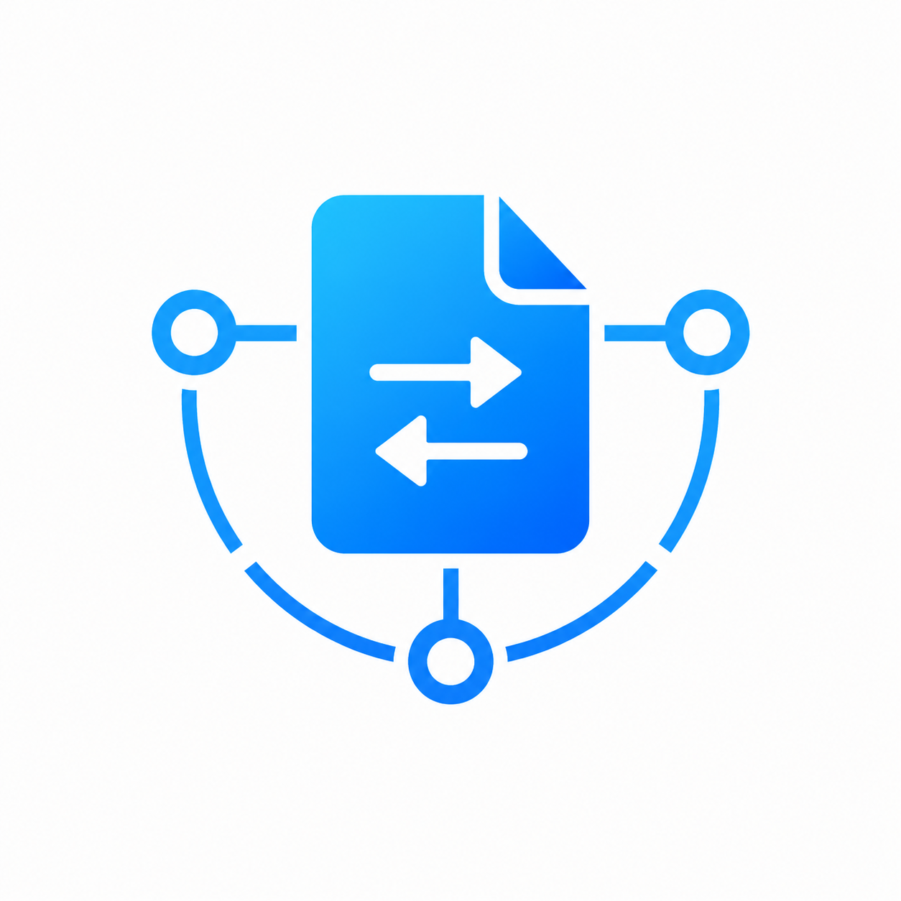

# 🚀 SyncFile - 局域网极速点对点文件传输工具

  

**SyncFile** 是一款基于 Flutter 构建的本地 Wi-Fi 文件、文本、语音互传工具，目前支持 Windows、Android。

---

## 📱 功能特性

### 1. 📡 自动设备发现 (无感连接)
* **雷达扫描**：开启雷达后，设备会通过 UDP 组播/广播（端口 `8888`）在局域网内进行心跳探测，并在 3 秒内自动呈现所有在线设备。
* **零配置**：无需输入对方 IP 地址或配对码，同网段下即开即现。

### 2. ⚡ 安全极速传输 (物理直连)
* **审批机制**：发送文件前，发送端会向接收端发送传输邀请，只有接收端确认“接受”后才会开始传输，防止垃圾文件骚扰。
* **分流上传**：每个大文件传输均建立独立的 TCP 数据通道（端口 `8889`），直接读写二进制流，速度仅受限于您的局域网路由器物理带宽。
* **断点续传**：基于 HTTP Range 协议，当传输中途断开或手动暂停后，再次发起相同文件的传输时可自动无缝续传。

### 3. 📂 多类型共享支持
* **混合发送**：支持同时发送照片、视频、应用包、大文件以及纯文本消息。
* **对话流 Timeline**：提供类似聊天室的往来历史面板，直观分类展示接收和发送的各项内容，支持点击查看/重试。

---

## 📝 TODO

- [ ] 支持 iOS 手机
- [x] 支持 macOS 电脑

